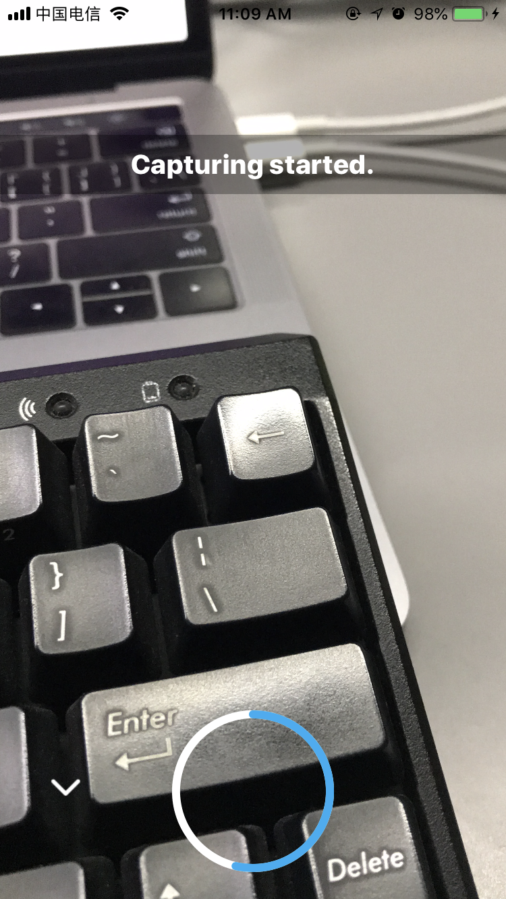
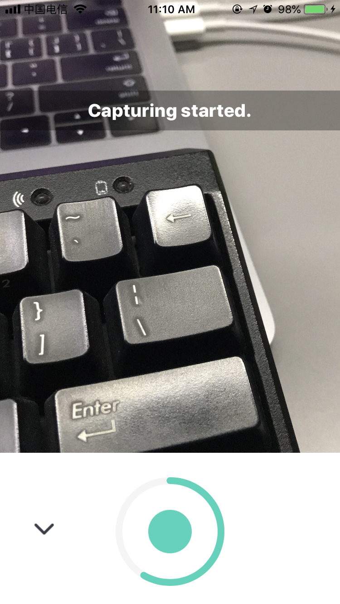

# MGCaptureControlView

[](https://travis-ci.org/memetghini@qq.com/MGCaptureControlView)
[](https://cocoapods.org/pods/MGCaptureControlView)
[](https://cocoapods.org/pods/MGCaptureControlView)
[](https://cocoapods.org/pods/MGCaptureControlView)
<p align="left" >
  
  
  
</p>
## Example

To run the example project, clone the repo, and run `pod install` from the Example directory first.

## Requirements

## Installation

MGCaptureControlView is available through [CocoaPods](https://cocoapods.org). To install
it, simply add the following line to your Podfile:

```ruby
pod 'MGCaptureControlView'
```

## Author

memetghini@qq.com, memetghini@qq.com

## License

MGCaptureControlView is available under the MIT license. See the LICENSE file for more info.
